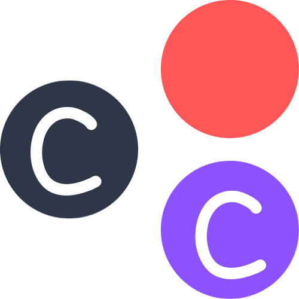

<h3 align="center">Change Simplified</h3>

 

---

 

 

What do you care about? Your health? Your kids? Your relationship? Caring for these things should be easy. So why isn't it?

 
 

One, good information, that is customised for you, is much more complex than anything you will read on platforms like Facebook, Instagram, Reddit, Quora, Google or Wikipedia. Two, the professionals who have the complex information you need, do not have the time, (or their time costs too much) so you don't go to them. 

1. Think about healthcare workers caring for you or someone you know in hospital. They write down hundreds of notes full of useful information but you can't see the notes without going through a lengthy access request. When you finally get access it's been months since the hospital visit. While in hospital you are anxiously waiting for information and when the clinician arrives you forget what you wanted to ask or you later forget what they told you.

2. Think about a GP appointment. You have less than 10 minutes to remember everything you have been experiencing, for them to ask questions, figure out a plan and write it down. 

3. Think about teachers at your kids' school. You have one short meeting every few months to ask many questions about your child's progress because the rest of the time teachers are too busy to tell you what's going on with your child.

4. Think about your oldest relative. When you go to see them you ask how they are, because you know they have been struggling, but they say "I'm fine" and that's the end of that.

 
 

Now imagine that when you got to any of those meetings, they already knew what your questions would be and have prepared the answers. Even better, when you get there they have a print-out of answers to all of your questions ready to go. Now imagine that they were able to do that with a verified template of multiple-choice questions so it took them seconds to create, instead of minutes or hours. You get the information you want, at the time you want it, and they can spend their precious time doing other things.

You need some way to get information that:

1. Has been professionally validated
2. That you can understand
3. That you can easily share with others

## 📝 Table of Contents

- [Problem Statement](#problem_statement)
- [Idea](#idea)
- [Solution](#solution)
- [Tech Stack](#tech_stack)
- [Dependencies / Limitations](#limitations)
- [Future Scope](#future_scope)
- [Lessons Learned](#lessons_learned)
- [Documentation](#documentation)
- [Authors](#authors)
- [Acknowledgments](#acknowledgments)

## 🧐 Problem Statement 

You care about many things. You do your best to take care of friends, family, pets and plants. But sometimes things change and you're not sure what to do. Luckily, you are a problem-solver, so you go online in search of support and advice. You ask lots of questions and get nowhere. Many times, this is because you ask 99/100 of the right questions, but couldn't think of the 100th question that would have solved your problem.

                    "Figuring out the right question to ask is 99% of the solution to any problem."
                    Jason Chalangary, 2023

In the healthcare industry, the process of asking every question and recording every answer currently takes approximately one hour to complete and is never 100% thorough or consistent because the professional has to use their heuristics (mental shortcuts) to decide what questions are appropriate and which ones are safe to skip. If you are older, you get more questions about mobility, if you are young you get more questions about sexual health, so neither approach is comprehensive. The reason for this is that it takes too long and is too tiring to ask every single possible question of every single patient. Worse still, if you did ask every question possible then writing a report about that interaction would take all day. So I set about seeing if there was a shortcut to get around this problem...

CareChange is a personal project I have been thinking through and planning for years, but never had the skill to complete. Now that I have completed the bootcamp and have a few projects completed, I am able to concentrate on building it. I figured that the solution must somehow make it fast enough and easy enough that every question could be asked at the clinical interaction. Like what if the patient/carer could complete a pre-consultation survey that monitors how things are going then the clinician could scan through it at the encounter. Most of the responses will be right most of the time, but some of the responses will be wrong most of the time; the clinician only needs to focus on the errors and not panic about covering themselves by asking all of the other questions. Two other issues arise in this: capacity and accountability.

Capacity

Most clinical assesment tools are complex and are designed to be completed by trained professionals. They were designed in a world without widespread access to tech skills that make it possible to customise an assessment according to the needs of the patient; instead it was reliant upon the exprerience and competence of the clinician to complete the forms accurately and throgoughly enough to mitigate risks to the patient and avoid the potential for litigation due to neglect. With a full stack javascript app it is possible to create questions that appear and disappear with a click of a button, customising the assessment according to what the patients wants there and then and there is zero training required to decide which buttons to press. Social media, for example, has made it possible for teenagers to run entire businesses from their phone and all the thinking is done by the app. In the same way, technology could be leveraged to make it possible for people with limited knowledge, limited capacity, or accessibility issues to be competent and confident caregivers.

Accountability

Accountability issues abound when technology is designed for use in healthcare. This is usually because usually the technology aims to substitute clinician decision-making. Even with machine learning making technological solutions that are proven to be vastly superior to human operators (ie. self-driving cars vs human drivers ) people are anxious to hand over responsibility or accountability to computers. If a nurse or doctor fails in their duty, they are liable for harm they cause to a patient and are insured for that purpose. Likewise, the trust they work for is immunised against litigation by having taken reasonable measures to ensure their staff member's qualifications, ongoing professional development and support. If technology fails, the argument goes, who is to blame? The technology company won't accept responsibility because they will deny that the software was at fault. The healthcare company won't accept responsibility for a technology that they do not understand. So the technology does not get implemented and people are still using 20th century tech 23 years into the 21st century.

The only way a software can avoid this issue is by being a "decision assistant tool" entirely transparent in a manner that a healthcare professional has full understanding of what is happening in the software they are using and can monitor the outputs of the technology to ensure that any errors are caught before harm is done. In other words, there needs to be a direct connection between the inputs given by a user and the outputs generated by the technology in such a way that it would be instantly obvious to the user that something has gone wrong with the technology.

## 💡 Idea 

The idea came from, of all things, cookie notices!

Why Cookie Notices?

Cookie notices are required by law to inform the public about how cookie data is collected and handled by a website. People click yes or no to cookies policy notices every day of their lives. This small piece of code is on nearly every single website most of us will ever encounter. It is part of the common language among anyone who has ever been on the internet. While people debate whether a hamburger menu icon is commonly understood, the same debate cannot be had regarding cookie policy notices because much of the time they prevent the actual use of a website until the user has confirmed their permissions for cookie use. People must know how to interact with a cookie notice to use the internet. Put simply, no response to a cookie notice, no internet.

How is that useful to healthcare?

Tax returns, NHS 111 online and even the settings page on a smartphone are like quizzes; they have a series of multiple choice questions and toggles the user can select. They are all, in essence, variations on a quiz with conditions built in to their algorithms to ensure that follow-up questions are relevant to the user based on previous responses. The user does not need to know which question to answer next, because the quiz only shows them questions relevant to the user. Users don't need to type anything so they don't need to think about what to type. Professionals working with the users' responses do not need to transcribe the responses because responses are written in the same format for each person. All the professional/hardware needs to know is the conclusion- what do they need to do. And for management, data and performance analysis becomes a lot easier.

So you want to make a quiz app for healthcare?

Well, yes!! Imagine if there was an app that used conditional logic to show ALL the relevant but very simple multiple choice questions that could possibly be asked in a clinical encounter and then output a simple description of what the clinician really cares about - "How can I help?" It would take a fraction of the time to complete the assessment, and reports and summaries would be instantaneous.

Even more excitingly, it would produce a dataset for each patient that would be completely uniform between healthcare professionals. This dataset would be the foundation of a common language with which departments could communicate between one another in a way that huge, complex and bloated software packages with many varieties of data type never could. This would reduce, if not eliminate entirely, the need for multiple teams duplicating data in a format that works for them, because they could copy the entire dataset in all inter-departmental communications using a single button. Likewise, the recipient could, if they wanted, run a custom filter on the entire dataset that only gave them the data they wanted. In one button they could query the dataset to say: "What do I need to do for this person? <button style="background-color: gray">Tell me</button>"

Additionally, a large loss of time and resources in the NHS is staff turnover. Whenever a staff member moves between teams and Trusts, they need to onboard to a new complex software package. Using a simple quiz design, whatever team a professional joined, they would be instantly at home using the data and the quiz because it would be the same across the NHS, and all they would need to do is click a single button to select the filter to display the data they need.

Finally, there are two self-imposed constraints that I have placed on the project:

1. No confidential information handled

It is a safe assumption to make that no NHS team will touch software made by me, unless I make it abundantly clear from the outset that absolutely no personally identifiable information will be handled or storeed by the app. Patient confidentiality is a huge point of sensitivity for senior executives in the NHS and it is for this reason that entire training courses are devoted to the safeguarding of patient data. In order to bypass these concerns from the outset, the brand of the app will be devoted to the message that NO identity information will be handled by the app. And neither will it be necessary. As with any company providing clinical assessment templates, (or to use a tech reference, UI components) the user gets the value from the efficiency gains provided by the software. Names, relationships, dates and contact details are only added later once the template has been copied into their existing medical record systems where strong security measures have been implemented to prevent data leaks.

2. No login or authentication required.

Another assumption that is safe to make is that NHS staff already have a lot of passwords and usernames to deal with. As someone who is a huge fan of minimal UI, when I perform a search online I will always prefer the website that does not require me to log in to access the value within the site. MDN, YouTube, Wikipedia and IMDb are good examples of implementations of this principle where the majority of users can get all the value they need without ever signing up or paying. For these sites, login is not justified in the vast majority of cases. Whenever a site is esssentially a repository that provides small components of information like data, images or templates they do not require a user to login because the time to login takes as long as getting the information required. Figma, Notion, Trello and LeetCode, for example, all require login. They require authentication to match users with work they have completed. The value comes from being able to spend hours building projects while progress is auto-saved to prevent data loss if the internet connection drops or the work was not completed within a single session. If I can make the UI simple enough that an average visit to the site takes as much time as an average visit to YouTube then I will have accomplished the goal and be justified in omitting login functionality. If a site visit is quick, easy and successful, the user will be more likely to come back and one day pay for the premium features. Additionally, I do not have the means to maintain a customer service department to handle account enquiries or issues with login details and resets. I need it to just work.

## 💡 Solution 

Number of pages : 1

Static/Dynamic : Static - Nothing about the page needs to change depending on the user viewing it.

Front-End

UX

The prospective users for this app will be front-line clinical staff, patients and carers. I imagined this app to be something that loads so fast that all these users would feel like the software was downloaded on their phones like a calculator. To that end, I would like to make it a PWA with 100% SSR to bring loads times as close to zero as possible for great UX. I also wanted limited graphics. If this is a work tool then users (especially clinicians) will be accessing the site multiple times per shift/ many times a day, so the key "joy" metric will be the least number of clicks/presses possible and fastest load times possible, including internet-limited places like remote residences with poor internet. Images would simply create more clicks and scrolls for users when they just want to get home at the end of the working day.

A search online for the best SSR front-end framework revealed that NextJS has excellent SSR intelligence to ensure that as little work as possible is left for CSR. There is also a huge trend towards Next since 2020 - which a solid community for support if I need to expand the app in the future. Finally, as for Server, I have been tempted into trying Azure by people working in healthcare who say it works great, has substantial software packages for every use-case I could have in the future (ie. analytics) and plenty of jobs are available for it. Being a static site offsets any concerns about latency benefits I might get from AWS having more data centres across the globe. They both have CDN for getting fast access to content, enhanced security for eliminating unwanted DDoS attacks. Limitations of Azure are that it lacks Geography-based routing, letting you restrict content to specific geographic locations, Latency-based routing, the ability to direct traffic according to latency levels measured by the DNS services, and DNSSEC signing, providing validation that a DNS response came from Amazon Route 53 and hasn’t been tampered with. None of these features should be a blocker to the app for the foreseeable future. At large scale, they both offer load balancing to automatically distribute traffic across multiple VM instances to improve the performance, fault tolerance, and availability of the application. Storage is not a factor in the decision because even long into the future I do not anticipate any large file types such as images or video being used on the app. Encryption is not a factor right now because no personal information will be collected, however in the future if this were required to offer a full package of software then this is available with Azure and again there is already established precedent of Azure being used for healthcare services in the UK, attesting to its quality over alternatives. Finally, regarding cost, across general purpose and memory-optimized instance types, AWS is 20% cheaper than Azure. The price gap widens for compute-optimized instance types, with AWS being 35% cheaper than its Azure equivalent. Overall though, both compute and storage loads will forever be extremely low for this app so cost was not a significant consideration.

UI

Whenever I search for a broadband speed test, Ookla (https://www.speedtest.net/) always comes near the top of the search list. I like Ookla. Every time I visit I know instantly what I am doing - clicking the giant <button>OK</button> button to test my internet. One click and done. It's simple, beautiful and a joy to use. Others work, but Ookla is the one I always use. I aim to create the same joy and simplicity in this app.

If possible, it would be great to make this a one page app, with the entire page rendered server-side by Next to reduce page load times if internet speed is not very fast.

What about the backend?

What backend?! Next.js has an API server route built into it that can serve our dataset for us from a local data folder that will be pre-rendered on the server-side without ever needing a separate server by simply using a built-in method caled getStaticProps. This will reduce development time, provide a better developer experience due to simplicity, simplify the tech stack to reduce potential breakage points, significantly reduce spin-up-time by hydrating the page with the data in the build step rather than the client-side, and will make it a lot easier to identify and fix bugs if any do occur. Also, SEO will be vastly improved because the server will have everthing already. Finally, it should also reduce server costs because we are not using a separate database server.

Why not just use HTML with Vanilla Javascript?

1. As above, server-side rendering should give us even faster page-load times than HTML/VanillaJS, especially once our database gets big!
2. If we use HTML and VanillaJS and we ever need to expand the functionality into a full-featured app with a much larger codebase, we would need to refactor the entire project into a component-based language to separate and organise our concerns. That process would take a lot of time and provide a poor developer experience.

Hosting?

In the last project I worked on, we used a free tier of Netlify for hosting. Getting it up and running was seemless enough but it meant that we were limited to 100GB of bandwidth per month and 300 build minutes per month.

Microsoft Azure has a service for static Web Apps that is free for hobbies/personal projects, includes 100GB bandwidth, 2 customised domains, and 0.25GB max size per deployment. There are multiple further services that may be good for future use, and competence with Azure services seems to be a common demand among job adverts for junior developers so would serve me well to learn now.

For now, as this is a side project for colleagues to play with, I need it online as soon as possible. Netlify worked last time, let's go with that. Also I have been hosting another site on NameBright without any problems so I will go with that as a host again.

## ⛏️ Tech Stack 

- [Next.JS](https://nextjs.org) - Database
- [Express.JS](https://expressjs.com/) - Server Framework
- [Next.JS](https://nextjs.org/) - Web Framework
- [Typescript](https://www.typescriptlang.org) - Web Framework
- [Node.JS](https://nodejs.org/en/) - Server Environment
- [Tailwind](https://tailwindcss.com) - CSS
- [Jest](https://jestjs.io) - Testing

## ⛓️ Dependencies / Limitations 

1. Next.js does not have a built-in state manager so we might need to use Redux or something similar as the app grows in complexity.
2. Next.js does not have as many plug-ins as Gatsby.js for example, because it is newer and therefore has a younger ecosystem surrounding it. As already mentioned, this app should be very simple by design, so should not require anything more than basic plug-ins.

## 🚀 Future Scope 

GraphQL - I discovered much too late in the project that this was in fact a graphQL data structure, because the relationship between the data points can change a lot when someone changes the order of the questions or adds a new question. This means that the

Long Version - The first iteration MVP was designed to support inpatient staff in their daily note-making workflow. In the community the assessments are carried out less often and with less oversight from clinical staff. There are, therefore, many more questions that need to be built into a comprehensive assessment for them. This long version is the next project I would like to build.

Build-Your-Own - I would love to make a flow buiilder that takes inputs and connects them together using key words to enable people unfamiliar with code to build their own custom templates.

Library - A catalogue of quiz templates all designed to streamline routine communications.

Verification - Just like verified profiles on social media, these templates are only as good as the user perceives them to be. In other words, quizzes will need to be validated/verified by professionals to ensure accuracy before use in clinical settings so that others have faith that the quiz is accurate/effective. Reputable organisations/professionals should be able to endorse quizzes that they deem safe to use. Or perhaps if the library grows really big, a Stack Overflow-style voting system to up-vote templates they prefer using to help others decide which template to use.

## 🏁 Visit Our Website 

You can sign up to our app by visiting <a href="www.carechange.com">CareChange</a>

## 🏫 Lessons Learned 

- Server-side rendering- optimising code for speed
- Test Driven Development using chatGPT
- Collaboration with healthcare professionals to design complex data structures
- Working alone is not as hard as I thought it would be as long as I have chatGPT with me to help me along the way.

## 📃 Documentation 

- [Our Team Manifesto]()
- [Code Style Guide]()
- [Branching Strategy]()
- [Making Pull Requests]()
- [Colour Pallet]()

## ✍️ Authors 

- https://github.com/jasonjjjc - Jason Chalangary

## 🎉 Acknowledgments 

Thank you School of Code for making this all possible!!

- https://www.schoolofcode.co.uk - https://github.com/SchoolOfCode
